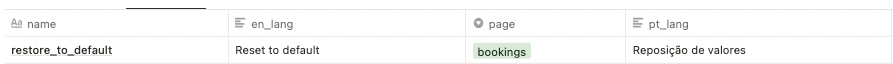

# Introduction

This is a simple proof-of-concept, which allows you to generate i18n json files based on Notion Database.

If you want something sofisticated and complete, you won't find this here. ( YET ? MAYBE ... )

# Notion Database model

### Model

- name => json key

- en_lang => "en" folder

- pt_lang => "pt" folder

- pages => this is the name of the filter, if you want to generate multiple json files

### Nested object

This is not possible yet, since this is a simple proof-of-concept.

### Disclaimer

That's all! You can save your time by modifing this project, instead start from scratch. (or not ? haha ...)

I'll try improve this every week, because i really want to use Notion as a language CRM. 

I'm not sure about Notion Database limitation, and this is not my priority right now.

Be safe and keep coding :)